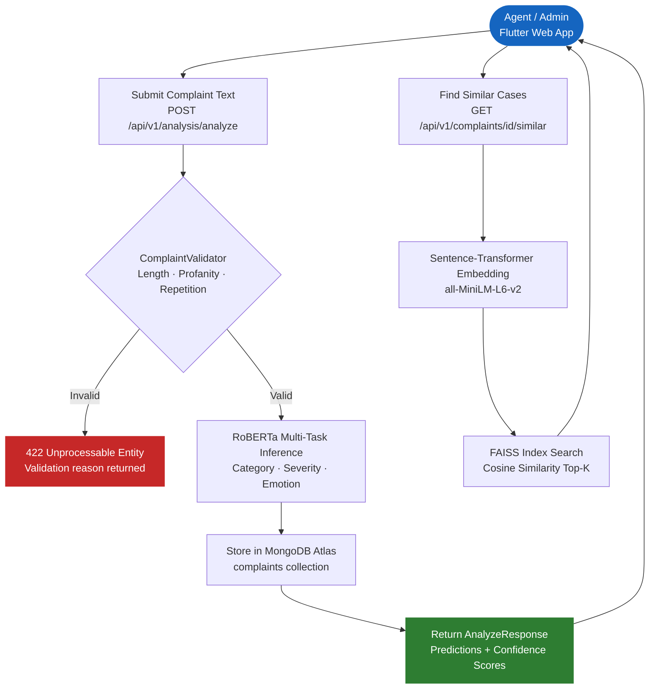

# 🏦 Gen-AI Powered Customer Complaint Analysis System


> **One-liner:** An AI-powered banking complaint management system that simultaneously classifies category, severity, and customer emotion using a custom fine-tuned RoBERTa model achieving **92.10%  of average accuracy** — with semantic similarity search to surface related cases instantly.

---

## 📌 Table of Contents

- [The Problem](#-the-problem)
- [Our Solution & Purpose](#-our-solution--purpose)
- [Why This Over Others](#-why-this-over-others)
- [Tech Stack](#-tech-stack)
- [System Flow](#-system-flow)
- [File Structure](#-file-structure)
- [Prerequisites](#-prerequisites)
- [Installation & Setup](#-installation--setup)
- [Usage](#-usage)
- [Configuration](#-configuration)
- [Screenshots](#-screenshots)
- [Contribution Guidelines](#-contribution-guidelines)
- [Known Limitations & Roadmap](#-known-limitations--roadmap)
- [License](#-license)

---

## 🚨 The Problem

Banking institutions receive thousands of customer complaints daily across ATM failures, fraud incidents, and digital banking issues. Managing these at scale is broken in three critical ways:

**Key pain points:**
- ⚠️ **Manual triage is slow and inconsistent** — agents individually read and categorize each complaint, leading to delays, misclassification, and burnout at high volumes.
- ⚠️ **No unified multi-label classification** — existing tools handle sentiment *or* category, but not category + severity + emotion simultaneously in a single inference pass.
- ⚠️ **Agents work in silos** — there is no mechanism to surface previously resolved similar complaints, forcing teams to repeatedly solve the same problems from scratch.

---

## 🎯 Our Solution & Purpose

**Gen-AI Powered Customer Complaint Analysis System** is a full-stack AI platform that automates complaint triage for banking operations teams, designed for complaint agents and bank administrators.

It solves the above by:
1. **Multi-task RoBERTa inference** — A single model predicts complaint category, severity level, and customer emotion simultaneously with 92.10% average accuracy, replacing hours of manual reading.
2. **Semantic similarity search (RAG)** — Every complaint is embedded using sentence-transformers and indexed in FAISS, allowing agents to instantly retrieve the top-K most similar past cases with resolution context.
3. **End-to-end case management** — A Flutter web frontend gives agents a full complaint lifecycle dashboard: submit, browse, filter, update status, add notes, and escalate — all backed by a persistent MongoDB Atlas database.

---

## ⚡ Why This Over Others

| Feature | This System | Generic Sentiment Tools | Manual Triage |
|---|:---:|:---:|:---:|
| Multi-task classification (category + severity + emotion) | ✅ | ❌ | ❌ |
| Domain-specific banking model | ✅ | ❌ | ✅ |
| Semantic similar-case retrieval (RAG + FAISS) | ✅ | ❌ | ❌ |
| Per-prediction confidence scores | ✅ | ⚠️ Partial | ❌ |
| Full complaint lifecycle management | ✅ | ❌ | ⚠️ Manual |
| CSV bulk upload with auto-classification | ✅ | ❌ | ❌ |
| Role-based access (Admin / Agent) | ✅ | ❌ | ⚠️ Manual |
| Free-tier cloud database (always-on) | ✅ | ❌ | ❌ |
| Open Source | ✅ | ❌ | — |

> 💡 **The bottom line:** This is the only open-source system that combines banking-specific multi-task classification, semantic case retrieval, and full complaint lifecycle management in a single platform.

---

## 🛠 Tech Stack

### Frontend
| Technology | Version | Purpose |
|---|---|---|
| Flutter Web | 3.x | Cross-platform UI framework |
| Dart | 3.x | Frontend language |
| Riverpod | 2.x | Reactive state management |
| GoRouter | 13.x | Declarative navigation and routing |

### Backend
| Technology | Version | Purpose |
|---|---|---|
| Python | 3.9+ | Runtime environment |
| FastAPI | 0.111+ | Async REST API framework |
| PyMongo | 4.6+ | MongoDB driver |
| python-jose | 3.3+ | JWT authentication |
| bcrypt | 4.0+ | Password hashing |

### ML / AI
| Technology | Version | Purpose |
|---|---|---|
| RoBERTa-base (fine-tuned) | Custom | Multi-task complaint classification |
| Transformers (HuggingFace) | 4.40+ | Model loading and inference |
| Sentence-Transformers | 2.7+ | Complaint text embedding for RAG |
| FAISS (CPU) | 1.8+ | Approximate nearest-neighbour search |
| Scikit-learn | 1.4+ | Classical ML fallback classifier |
| PyTorch | 2.1+ | Deep learning backend |

### Database & Storage
| Technology | Version | Purpose |
|---|---|---|
| MongoDB Atlas | M0 Free | Primary persistent database (always-on) |
| GitHub Releases | — | Model weight storage (pytorch_model.pt ~500MB) |

---

## 🔄 System Flow



### Flow Explanation

| Step | Description |
|---|---|
| **Entry Point** | Agent submits complaint text from Flutter frontend → `POST /api/v1/analysis/analyze` is called with a Bearer JWT token |
| **Validation** | `ComplaintValidator` checks minimum word count (10), maximum word count (300), repetitive word detection, and explicit profanity — returns 422 with reason on failure |
| **RoBERTa Inference** | Fine-tuned `RoBERTa-base` model runs three classification heads in one forward pass → outputs `category`, `severity`, `emotion` with per-class confidence scores |
| **MongoDB Storage** | Classified complaint document is inserted into MongoDB Atlas `complaints` collection with UUID `_id`, timestamps, and all metadata |
| **Response** | `AnalyzeResponse` returned to Flutter with predictions and confidence scores, displayed as metric tiles and coloured progress bars |
| **Similar Cases (RAG)** | On demand, complaint text is embedded by `all-MiniLM-L6-v2`, searched against FAISS index, top-5 similar past complaints returned with similarity scores |

---

## 📁 File Structure

```
Gen-AI-Powered-Customer-Complaint-Analysis-System/
│
├── api/                                # FastAPI application layer
│   ├── main.py                         # App entry point — lifespan, middleware, router registration
│   ├── dependencies.py                 # DI: ML singleton, auth guards (require_agent, require_admin)
│   ├── routers/
│   │   ├── analysis.py                 # ML endpoints: upload CSV, analyze, batch-analyze, RAG rebuild
│   │   ├── complaints.py               # CRUD endpoints: list, status update, similar cases, notes
│   │   ├── auth.py                     # Auth endpoints: login, register, /me
│   │   ├── health.py                   # Health + readiness check (pings MongoDB)
│   │   └── models.py                   # Model management: train, info, run history
│   └── schemas/
│       ├── auth.py                     # Pydantic schemas: Token, UserCreate, UserResponse
│       ├── complaint.py                # Pydantic schemas: AnalyzeRequest/Response, ComplaintList
│       └── model.py                    # Pydantic schemas: TrainResponse, ModelRunRecord
│
├── core/                               # Domain logic — framework-agnostic
│   ├── startup.py                      # Shared boot sequence: seed_admin, download_weights, init_rag
│   ├── database.py                     # PyMongo client, get_db(), ensure_indexes()
│   ├── db_models.py                    # Document factories (new_user, new_complaint) + wrapper classes
│   ├── settings.py                     # Pydantic settings loaded from .env
│   ├── auth.py                         # JWT creation/decoding, password hashing
│   ├── analysis/
│   │   ├── multi_task_model.py         # RoBERTa-base multi-task classifier (primary model)
│   │   ├── classifier.py               # TF-IDF + RF classical fallback classifier
│   │   ├── rag_engine.py               # FAISS index build/load/search (sentence-transformers)
│   │   ├── evaluator.py                # Model evaluation utilities
│   │   └── preprocessor.py             # Text cleaning and preprocessing
│   └── validation/
│       └── complaint_validator.py      # Text quality checks (length, profanity, repetition)
│
├── flutter_frontend/
│   └── lib/
│       ├── main.dart                   # App entry point — ProviderScope, MaterialApp
│       ├── router.dart                 # GoRouter config — ShellRoute, auth redirect, /dashboard default
│       ├── core/
│       │   ├── api/api_client.dart     # HTTP client — all API calls, token injection
│       │   ├── constants/
│       │   │   └── app_constants.dart  # Central constants: categories, severities, statuses, API paths
│       │   ├── models/
│       │   │   ├── complaint.dart      # Complaint + SimilarComplaint model classes
│       │   │   └── auth_models.dart    # User + AuthState model classes
│       │   ├── providers/
│       │   │   ├── auth_provider.dart  # Auth state notifier (login/logout/token persistence)
│       │   │   └── complaints_provider.dart # FutureProviders for complaints, filters, similar cases
│       │   └── theme/app_theme.dart    # Colour palette, text styles, severity/status/category colours
│       ├── screens/
│       │   ├── shell_screen.dart       # Animated sidebar navigation (220px / 68px collapsed)
│       │   ├── login_screen.dart       # Login form with JWT auth
│       │   ├── dashboard_screen.dart   # Analytics overview — complaint volume, category/severity charts
│       │   ├── cases_screen.dart       # Master-detail complaint browser with filters (~150 lines)
│       │   └── submit_complaint_screen.dart # Complaint submission form with result card
│       └── widgets/                    # Reusable UI components
│           ├── mini_chip.dart          # MiniChip + SeverityDot badges
│           ├── label_chip.dart         # Labelled chip for detail view (e.g. "Category: FRAUD")
│           ├── filter_dropdown.dart    # Compact styled dropdown for list filtering
│           ├── complaint_tile.dart     # Single row in complaint list
│           ├── complaint_detail_panel.dart # Full detail view with status update + notes
│           ├── similar_cases_panel.dart    # RAG results panel with similarity scores
│           └── rebuild_rag_tile.dart       # Admin expandable tile to rebuild FAISS index
│
├── models/                             # Model weights (downloaded at runtime — not committed)
│   └── multitask_model/
│       ├── pytorch_model.pt            # Fine-tuned RoBERTa weights (~500MB) — via GitHub Releases
│       ├── config.json                 # Model architecture config
│       └── label_maps.json             # Class label mappings for all three tasks
│
├── scripts/
│   ├── prepare_cfpb_data.py            # Prepare CFPB public dataset CSV for seeding
│   └── seed_from_cfpb.py               # Bulk-insert CFPB complaints into MongoDB
│
├── tests/
│   ├── conftest.py                     # Pytest fixtures — mongomock in-memory DB override
│   ├── unit/
│   │   ├── test_classifier.py          # Unit tests for classical ML classifier
│   │   └── test_validator.py           # Unit tests for ComplaintValidator
│   └── integration/
│       └── test_api.py                 # Integration tests against FastAPI TestClient
│
├── .env                                # Local secrets — NEVER COMMIT
├── .env.example                        # Documented env variable reference — commit this
├── .gitignore
├── Dockerfile                          # Production container definition
├── pyproject.toml                      # Python project metadata and dependencies
├── requirements.txt                    # Flat dependency list for pip install
└── README.md
```

---

## 🧰 Prerequisites

Ensure the following are installed before proceeding:

| Requirement | Minimum Version | Check Command | Download |
|---|---|---|---|
| Python | 3.9+ | `python3 --version` | [python.org](https://python.org) |
| pip | 23.x | `pip --version` | Bundled with Python |
| Flutter SDK | 3.0+ | `flutter --version` | [flutter.dev](https://flutter.dev) |
| Dart SDK | 3.0+ | `dart --version` | Bundled with Flutter |
| Git | 2.x | `git --version` | [git-scm.com](https://git-scm.com) |

> ⚠️ **OS Compatibility:** Tested on macOS 14+. Linux (Ubuntu 22.04+) is supported. Windows requires WSL2 for the Python backend.

> ☁️ **MongoDB Atlas:** A free MongoDB Atlas M0 cluster is required. Sign up at [cloud.mongodb.com](https://cloud.mongodb.com) — no credit card needed for the free tier.

---

## 🚀 Installation & Setup

### 1. Clone the Repository

```bash
git clone https://github.com/MNADITYA05/Gen-AI-Powered-Customer-Complaint-Analysis-System.git
cd Gen-AI-Powered-Customer-Complaint-Analysis-System
```

### 2. Configure Environment Variables

```bash
cp .env.example .env
```

Open `.env` and fill in your MongoDB Atlas connection string and other values. See the [Configuration](#-configuration) section for a full reference.

### 3. Install Python Dependencies

```bash
pip install -r requirements.txt
```

> 💡 PyTorch (~800MB) will be downloaded on first install. This may take a few minutes.

### 4. Start the Backend

```bash
uvicorn api.main:app --reload --port 8000
```

On first run the backend will automatically:
- Create MongoDB indexes
- Seed a default admin user
- Download RoBERTa model weights from GitHub Releases (~500MB)
- Build the FAISS similarity index

### 5. Start the Flutter Frontend

Open a second terminal:

```bash
cd flutter_frontend
flutter pub get
flutter run -d chrome
```

### 6. Verify the Setup

```
✅ Backend API:  http://localhost:8000
✅ API Docs:     http://localhost:8000/docs
✅ Flutter App:  http://localhost:PORT (shown in terminal)
✅ MongoDB:      connected (check GET /health/ready)
✅ Model:        loaded (RoBERTa-base multitask)
```

Log in with the default admin credentials set in your `.env` (`DEFAULT_ADMIN_USERNAME` / `DEFAULT_ADMIN_PASSWORD`).

---

## 💡 Usage

### Quick Start — Analyze a Complaint

```bash
# 1. Login to get a JWT token
curl -X POST http://localhost:8000/auth/login \
  -H "Content-Type: application/json" \
  -d '{"username": "admin", "password": "your-password"}'

# 2. Analyze a complaint
curl -X POST http://localhost:8000/api/v1/analysis/analyze \
  -H "Authorization: Bearer <token>" \
  -H "Content-Type: application/json" \
  -d '{"text": "My ATM card was swallowed by the machine and I cannot withdraw cash."}'
```

**Expected output:**
```json
{
  "category": "ATM_FAILURE",
  "severity": "high",
  "emotion": "frustrated",
  "confidence": {
    "category": 0.94,
    "severity": 0.88,
    "emotion": 0.91
  }
}
```

### Common Commands

| Command | Description |
|---|---|
| `uvicorn api.main:app --reload` | Start backend with hot reload |
| `uvicorn api.main:app --port 8000` | Start backend (production mode) |
| `flutter run -d chrome` | Start Flutter web app |
| `flutter build web` | Build Flutter for production deployment |
| `pytest tests/` | Run all test suites |
| `python scripts/seed_from_cfpb.py --input data/cfpb_prepared.csv` | Bulk-seed complaints from CFPB dataset |

### Flutter App Workflows

| Workflow | Screen | Description |
|---|---|---|
| **Dashboard** | `/dashboard` | View complaint volume, category distribution, severity breakdown |
| **Submit Complaint** | `/submit` | Enter text → get instant category, severity, emotion + confidence scores |
| **Browse Cases** | `/cases` | Filter by category/severity/status, update case status, add agent notes |
| **Similar Cases** | Cases detail panel | Click "Find Similar" to retrieve top-5 semantically similar past complaints |
| **Bulk Upload** | `/submit` (CSV tab) | Upload a CSV of complaints for batch classification and storage |

---

## ⚙️ Configuration

All configuration is managed via environment variables. Copy `.env.example` to `.env` and populate the values below.

| Variable | Required | Default | Description |
|---|:---:|---|---|
| `MONGODB_URL` | ✅ | — | Full MongoDB Atlas connection string (`mongodb+srv://...`) |
| `MONGODB_DB_NAME` | No | `complaint_analysis` | MongoDB database name |
| `SECRET_KEY` | ✅ | — | Secret key for signing JWT tokens — use a random 32+ char string |
| `DEFAULT_ADMIN_USERNAME` | No | `admin` | Username for the auto-seeded admin account |
| `DEFAULT_ADMIN_PASSWORD` | ✅ | — | Password for the auto-seeded admin account — change this |
| `MODEL_DIR` | No | `models` | Directory where RoBERTa weights are stored / downloaded |
| `ACCESS_TOKEN_EXPIRE_MINUTES` | No | `480` | JWT token lifetime in minutes (default 8 hours) |
| `MLFLOW_TRACKING_URI` | No | `sqlite:///./mlruns.db` | MLflow tracking URI for training run logging |

> 🔐 **Security:** Never commit your `.env` file. It is already in `.gitignore`. For production, use your platform's secret management (e.g., GitHub Secrets, environment variables on your server).

---

## 🖼 Screenshots

| View | Preview |
|---|---|
| Dashboard |  |
| Submit Complaint |  |
| Cases Browser |  |
| Similar Cases (RAG) |  |

---

## 🤝 Contribution Guidelines

Contributions of all kinds are welcome — bug fixes, features, and documentation.

### Getting Started

1. **Fork** the repository
2. **Create** a branch from `main`:
   ```bash
   git checkout -b feat/your-feature-name
   # or
   git checkout -b fix/your-bug-description
   ```
3. **Make** your changes with clear, atomic commits
4. **Push** to your fork and open a Pull Request

### Branch Naming Convention

| Type | Pattern | Example |
|---|---|---|
| New feature | `feat/[short-description]` | `feat/email-notifications` |
| Bug fix | `fix/[short-description]` | `fix/rag-cold-start` |
| Documentation | `docs/[short-description]` | `docs/update-api-reference` |
| Refactor | `refactor/[short-description]` | `refactor/auth-middleware` |
| Hotfix | `hotfix/[short-description]` | `hotfix/token-expiry-crash` |

### Commit Message Format

Follow [Conventional Commits](https://www.conventionalcommits.org/):

```
<type>(scope): short description

[optional body]
```

**Examples:**
```
feat(analysis): add batch CSV classification endpoint
fix(rag): handle empty index on cold start
docs(readme): update installation steps
refactor(flutter): extract complaint widgets to lib/widgets/
```

### Pull Request Checklist

Before submitting a PR, confirm:
- [ ] Code follows project style (`ruff check .` for Python, `flutter analyze` for Dart)
- [ ] All tests pass (`pytest tests/`)
- [ ] New functionality is covered by tests
- [ ] Documentation is updated if needed
- [ ] PR description clearly explains *what* and *why*

> 💬 For major changes, open an issue first to discuss the approach before investing time in implementation.

---

## 🛤 Known Limitations & Roadmap

### Current Limitations

- ⚠️ **Model cold start** — RoBERTa weights (~500MB) are downloaded from GitHub Releases on first run, which takes 2–5 minutes depending on connection speed.
- ⚠️ **RAG index is not auto-refreshed** — after bulk CSV imports, an admin must manually trigger `POST /api/v1/analysis/rag/rebuild` to update the FAISS similarity index.
- ⚠️ **MongoDB Atlas free tier is 512MB** — the M0 cluster is sufficient for development and demos but will need upgrading for production-scale complaint volumes.
- ⚠️ **No cloud deployment included** — the system is designed to run locally. Cloud deployment (Oracle Cloud Free Tier recommended for the backend) requires manual provisioning.

### Roadmap

| Status | Milestone | Target |
|:---:|---|---|
| ✅ Done | Multi-task RoBERTa model training (92.10% avg accuracy) | v1.0 |
| ✅ Done | FastAPI backend with JWT auth and RBAC | v1.0 |
| ✅ Done | Flutter Web frontend (Dashboard, Cases, Submit) | v1.0 |
| ✅ Done | RAG similar-case retrieval (sentence-transformers + FAISS) | v1.0 |
| ✅ Done | MongoDB Atlas migration (always-on free tier) | v1.0 |
| ✅ Done | Model weights hosted on GitHub Releases | v1.0 |
| 🔄 In Progress | Cloud backend deployment (Oracle Cloud Free Tier) | v1.1 |
| 🔄 In Progress | Flutter Web deployment (Netlify) | v1.1 |
| 📋 Planned | Automatic RAG index refresh after bulk imports | v1.2 |
| 📋 Planned | Email notifications on high-severity complaints | v1.2 |
| 💡 Exploring | Multi-language complaint support | Future |
| 💡 Exploring | Real-time complaint feed via WebSocket | Future |

---

## 📄 License

This project is licensed under the **MIT License**.
See the [LICENSE](./LICENSE) file for full details.

---

<div align="center">

Built with ❤️ by [MNADITYA05](https://github.com/MNADITYA05)

[⭐ Star this repo](https://github.com/MNADITYA05/Gen-AI-Powered-Customer-Complaint-Analysis-System) · [🐛 Report a Bug](https://github.com/MNADITYA05/Gen-AI-Powered-Customer-Complaint-Analysis-System/issues) · [💡 Request a Feature](https://github.com/MNADITYA05/Gen-AI-Powered-Customer-Complaint-Analysis-System/issues)

</div>
